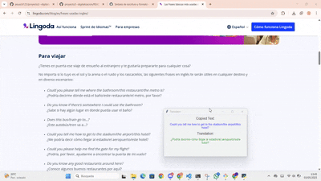
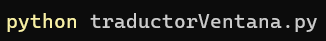
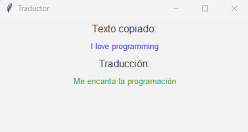
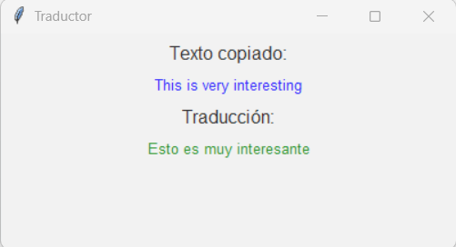

# proyecto2--digitalizacion

### TRADUCTOR EN TIEMPO REAL

## Welcome to the real-time translator!
- This project was created with the idea of helping millions of people who either don’t know English or are currently learning it, making their lives easier through real-time translation.
We know that everything is in English nowadays—assembly instructions, appliances, guides, and more. With this real-time translator, you can translate anything you want quickly and easily without having to search for translators.
It works by detecting any phrase or word that exists in the clipboard, meaning anything that has been copied beforehand. Once the content you want to translate has been copied, the program sends it to Google Translate for automatic translation—no delays or searches required. This allows anyone (even without prior computer knowledge) to simply highlight a phrase and see it instantly translated.

## Demo

## Instructions for deployment:
To deploy this project, you simply need to have Python installed on your computer. Once it's installed, download "traductorVentana.py", run it, and a pop-up window will appear indicating that the program has started. It will then be ready to copy and translate anything you need.

## Usage examples
This real-time translator uses the Google Translate API to translate text from one language to another. The data flow between the various components works as follows:
1. **User Interaction**: The user enters the text to be translated, which is captured by the pop-up window.
2. **Translation Process**: The entered text is sent to the Google Translate API for processing.
3. **Real-Time Update**: The translation result is received and displayed in the same pop-up window.
4. **Window Update**: The interface automatically updates without requiring user intervention.

## Integration Between Data and Aplications
The system is designed to integrate effectively with the following components:

**Google Translate API**: Facilitates real-time text translation.

**Operating System**: The app runs on platforms compatible with Kotlin and is adaptable to both Windows and macOS.

**Graphical Interface**: Uses Tkinter to create the interactive pop-up window, allowing for the real-time display of translations.

## Proposals for Improving Interoperability
**Support for Other Translation APIs**: Enhance interoperability by enabling the app to connect to additional translation services (Microsoft Translator).

**Cross-Platform Support**: Improve integration to make the application fully functional on both Android and desktop platforms (Windows, macOS, and Linux) by leveraging Python's cross-platform libraries.

**Optimization for Slow Connections**: Implement an option to cache frequently translated texts, so the system does not always rely on an internet connection to translate previously translated content.

## Basic Example
#### The translator works in real time.
1. your copy: I love programming.
2. Popup: Me encanta la programación.
   

4. Then you copy: This is very interesting.
5. Updated popup: Esto es muy interesante.

