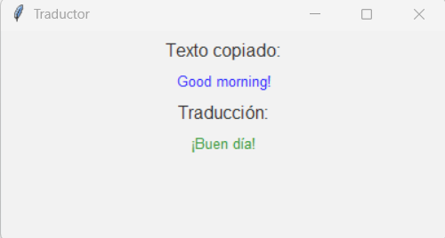

# proyecto2--digitalizacion

### TRADUCTOR EN TIEMPO REAL

## Welcome to the real-time translator!
- This project was created with the idea of helping millions of people who either don’t know English or are currently learning it, making their lives easier through real-time translation.
We know that everything is in English nowadays—assembly instructions, appliances, guides, and more. With this real-time translator, you can translate anything you want quickly and easily without having to search for translators.
It works by detecting any phrase or word that exists in the clipboard, meaning anything that has been copied beforehand. Once the content you want to translate has been copied, the program sends it to Google Translate for automatic translation—no delays or searches required. This allows anyone (even without prior computer knowledge) to simply highlight a phrase and see it instantly translated.

## Instructions for deployment:
To deploy this project, you simply need to have Python installed on your computer. Once it's installed, download "traductorVentana.py", run it, and a pop-up window will appear indicating that the program has started. It will then be ready to copy and translate anything you need.

## Usage examples
1. Basic phrase: Good morning!
2. The popup window displays: ¡Buen día!

### The translator works in real time.
1. your copy: I love programming.
2. Popup: Me encanta la programación.

3. Then you copy: This is very interesting.
4. Updated popup: Esto es muy interesante.

